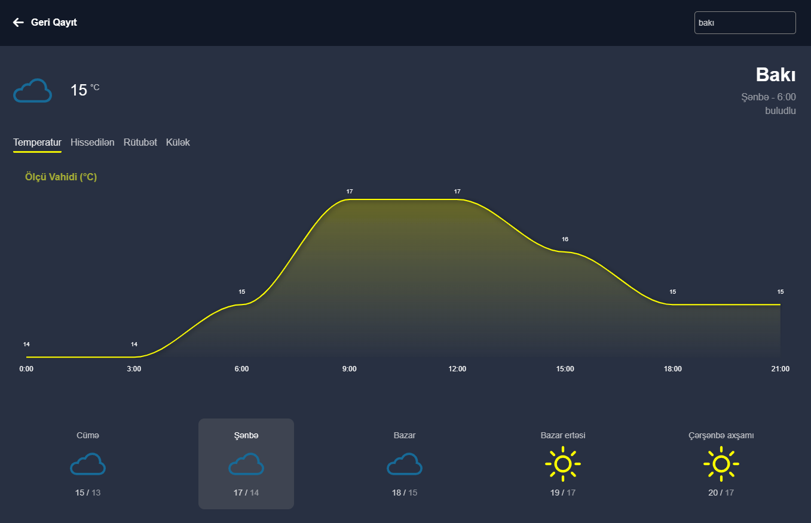

# Weather Forecast App

## Description

This is a simple weather forecast app that uses the OpenWeatherMap API to get the weather forecast for a given city.

## Features

-   Get the weather forecast for a given city
-   Get the weather forecast for the next 5 days
-   Get humadiy, pressure, and wind speed information
-   Get the weather forecast for the next 5 days in 3-hour intervals

## Technologies

-   HTML
-   CSS
-   JavaScript
-   OpenWeatherMap API
-   dayjs
-   i18next
-   apexcharts

## Setup

1. Clone this repository to your local machine.
2. Run `npm install` to install the necessary dependencies.
3. Ensure you have your own OpenWeatherMap API key. If you don't have one, you can obtain it [here](https://openweathermap.org/api).
4. Create a `.env` file in the root directory of the project.
5. Add the following environment variables to your `.env` file:
    - `VITE_API_KEY = "<your API key here>"`
6. Save the `.env` file.
7. Run `npm run dev` to start the development server.

## Demo

You can view the live demo [here](https://app-weather-forecast.vercel.app/)
